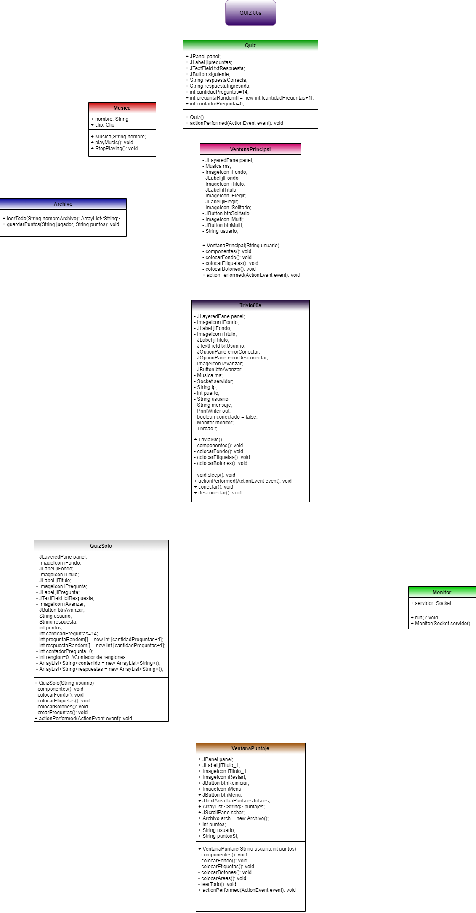

# Proyecto (TRIVIA 80s)
Este es un programa en entorno gráfico (JAVA) intentando integrar la mayoria de los temas vistos a lo largo del semestre. La codificación y diseño del programa se llevó a cabo en aproximadamente 20 días entre dos desarrolladores.
## Contenido
El juego cuenta con las siguientes características como: una estructura jerárquica de clases, interacción entre los elementos, manejo de imágenes, manejo de sprites, manejo de archivos (lectura y escritura), reproducción de sonidos (MIDI), manejo de código peligroso (try-catch)., entre otras características extras que se aprendieron por propia cuenta o se dedujieron a partir de lo visto durante el transcurso del semestre.
Al ingresar al juego te pedira un nombre de usuario, para despues desplegar un menu que te permitira ingresar a dos tipos distintos de trivias con tema de los 80s con preguntas aleatorios, una permitiendo avanzar por medio de un boton y otra a travez de un timer; aumentando el nivel de dificultad.
## UML

## Preview
