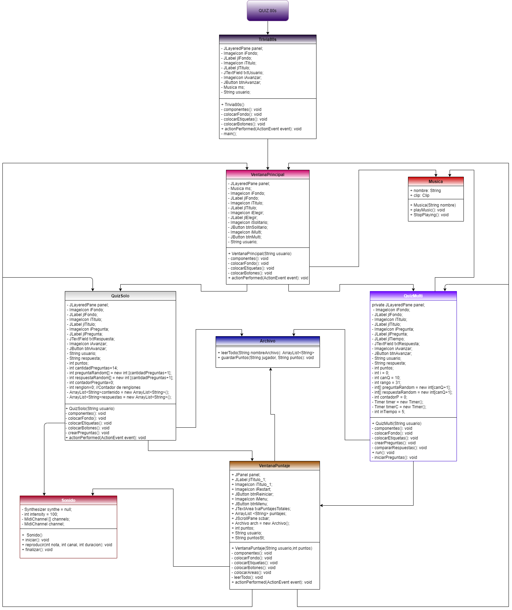

# Proyecto (TRIVIA 80s)
Este es un programa en entorno gráfico (JAVA) intentando integrar la mayoria de los temas vistos a lo largo del semestre. La codificación y diseño del programa se llevó a cabo en aproximadamente 20 días entre dos desarrolladores.
## Contenido
## UML

